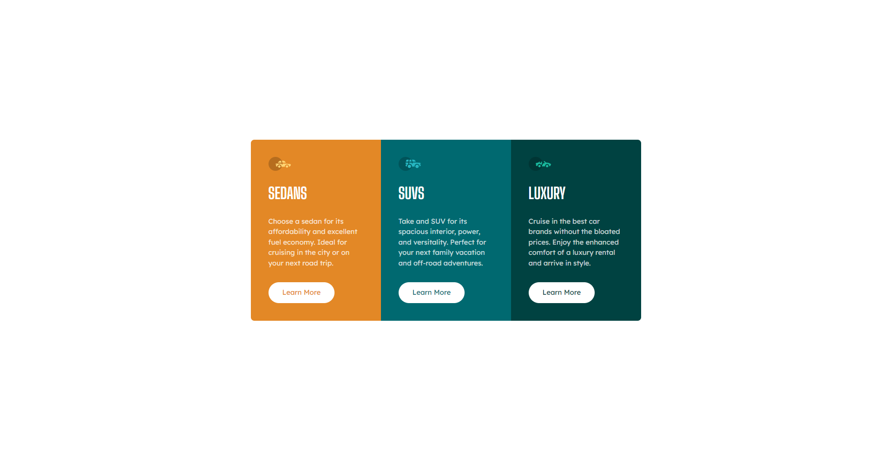

# Frontend Mentor - 3-column preview card component solution

This is a solution to the [3-column preview card component challenge on Frontend Mentor](https://www.frontendmentor.io/challenges/3column-preview-card-component-pH92eAR2-). Frontend Mentor challenges help you improve your coding skills by building realistic projects. 

## Table of contents

- [Overview](#overview)
  - [The challenge](#the-challenge)
  - [Screenshot](#screenshot)
  - [Links](#links)
- [My process](#my-process)
  - [Built with](#built-with)
  - [What I learned](#what-i-learned)
  - [Continued development](#continued-development)
  - [Useful resources](#useful-resources)

## Overview

### The challenge

Users should be able to:

- View the optimal layout depending on their device's screen size
- See hover states for interactive elements

### Screenshot


### Links

- Solution URL: [Add solution URL here](https://your-solution-url.com)
- Live Site URL: [Add live site URL here](https://your-live-site-url.com)

## My process

### Built with

- Semantic HTML5 markup
- Mobile-first workflow
- [Vue](https://vuejs.org/) - JS library
- [Tailwind CSS](https://tailwindcss.com/) - For styles

### What I learned

This is ( by far ), the most complicated challenge I've done. Yes, it's just a *Newbie* challenge but I'd used a lot of new concept that I learned. Like *Types*, *clsx* for conditional styles, as well as other packages such as *@unhead/vue*.

`defineProps()` with TypeScript is especially tricky for me. I need to use `PropType<>` otherwise TypeScript will complain about it. It's pretty simple once you understand it, like this:
```js
carData: { 
  type: Object as PropType<carType>, // This tells TypeScript that carData uses carType types.
  required: true 
  }
```

### Continued development

There's a lot that I needed to learn about Vue and TypeScript, I didn't think my solution is that good. Yes, I'm going to use Vue as main library for now on.

### Useful resources

- [How to use define props with TypeScript](https://stackoverflow.com/questions/71055016/vue-3-defineprops-with-types-and-componentobjectpropsoptions-like-default-or-va) - If not because of this, i'll probably stuck with define props for hours
- [How to use CLSX](https://www.delftstack.com/howto/react/react-clsx/) - In this article, the example is in React but could also apply in vue.